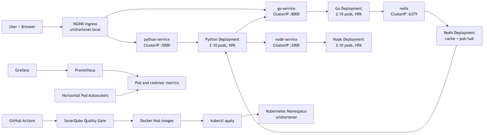

# URL Shortener Microservices — Capstone Project

A production-ready URL shortener built as three independent microservices deployed on Kubernetes with full CI/CD, autoscaling, monitoring, and load testing.

---

## Table of Contents

1. [Architecture](#architecture)
2. [Services](#services)
3. [Repository Structure](#repository-structure)
4. [Local Development](#local-development)
5. [Kubernetes Deployment](#kubernetes-deployment)
6. [Autoscaling (HPA)](#autoscaling-hpa)
7. [CI/CD Pipeline](#cicd-pipeline)
8. [SonarQube Code Quality](#sonarqube-code-quality)
9. [Monitoring](#monitoring)
10. [Load Testing](#load-testing)
11. [Docker Hub](#docker-hub)

---

## Architecture



> Diagram source: [docs/architecture.mmd](docs/architecture.mmd)
>
> Re-render: `npx @mermaid-js/mermaid-cli --input docs/architecture.mmd --output docs/architecture.png --backgroundColor white --width 1400`

**Traffic flow:**

1. External users reach the **NGINX Ingress** at `http://urlshortener.local`.
2. Dashboard and URL-creation requests (`/`) route to the **Python service**.
3. Python calls **Go service** internally (`/api/shorten`) to generate a short code, then calls **Node.js service** to fetch page metadata.
4. Redirect requests (`/u/{code}`) route through Ingress to **Go service**, which checks **Redis cache** first, falls back to SQLite, and publishes a click event to Redis pub/sub.
5. **Python service** subscribes to Redis click events and persists analytics.
6. **Prometheus** scrapes pod and cAdvisor metrics; **Grafana** visualises them on dashboards.
7. **Horizontal Pod Autoscalers** scale all three application deployments between 2 and 10 replicas based on CPU (60 %) and memory (75 %) utilisation.

---

## Services

| Service | Language | Port | Role |
|---------|----------|------|------|
| Go service | Go + Gin | 8000 | Fast redirects, URL creation, Redis pub/sub |
| Python service | Python + Flask | 5000 | Dashboard, analytics, URL orchestration |
| Node.js service | Node.js + Express | 3000 | Page metadata fetching (title, favicon) |
| Redis | Redis 7 | 6379 | Cache + pub/sub message broker |

**Communication patterns:**

- Python → Go: HTTP POST `/api/shorten` (synchronous, internal ClusterIP)
- Python → Node.js: HTTP POST `/api/metadata` (synchronous, internal ClusterIP)
- Go → Redis: pub/sub publish on `click_events` channel
- Python → Redis: pub/sub subscribe on `click_events` channel
- Go → Redis: `GET`/`SET` cache for redirect lookups (1-hour TTL)

---

## Repository Structure

```
.
├── .github/workflows/
│   └── deploy.yml          # GitHub Actions CI/CD pipeline
├── docs/
│   ├── architecture.mmd    # Mermaid architecture diagram source
│   └── architecture.png    # Rendered diagram (PNG for submission)
├── go-service/
│   ├── Dockerfile          # Multi-stage scratch image
│   ├── main.go
│   ├── go.mod
│   └── go.sum
├── python-service/
│   ├── Dockerfile
│   ├── app.py
│   ├── requirements.txt
│   └── templates/dashboard.html
├── node-service/
│   ├── Dockerfile
│   ├── server.js
│   └── package.json
├── k8s/
│   ├── namespace.yaml
│   ├── configmap.yaml
│   ├── secret.yaml
│   ├── ingress.yaml
│   ├── go/
│   │   ├── deployment.yaml
│   │   ├── service.yaml
│   │   └── hpa.yaml
│   ├── python/
│   │   ├── deployment.yaml
│   │   ├── service.yaml
│   │   └── hpa.yaml
│   ├── node/
│   │   ├── deployment.yaml
│   │   ├── service.yaml
│   │   └── hpa.yaml
│   └── redis/
│       ├── redis-deployment.yaml
│       └── redis-service.yaml
├── monitoring/
│   ├── prometheus/prometheus.yaml   # RBAC + ConfigMap + Deployment + Service
│   └── grafana/grafana.yaml         # ConfigMap + Deployment + Service
├── load-test/
│   ├── k6-test.js          # k6 peak-traffic scenario
│   └── load-test-report.md # Evidence checklist and expected results
├── sonar-project.properties
└── docker-compose.yml
```

---

## Local Development

**Prerequisites:** Docker, Docker Compose

```bash
# Clone and start all services
git clone <repo-url>
cd urlshortner-microservices
docker-compose up --build
```

| Endpoint | URL |
|----------|-----|
| Dashboard | <http://localhost:5000> |
| Go health | <http://localhost:8000/health> |
| Node health | <http://localhost:3000/health> |

**Useful commands:**

```bash
# View all logs
docker-compose logs -f

# Logs for a single service
docker-compose logs -f go-service

# Stop and remove volumes (resets databases)
docker-compose down -v

# Rebuild after code changes
docker-compose up --build
```

---

## Kubernetes Deployment

### Prerequisites

- Kubernetes cluster (EKS / GKE / AKS / DigitalOcean / Minikube) with **Metrics Server** enabled
- **NGINX Ingress Controller** installed
- `kubectl` configured for the cluster
- Docker images pushed to Docker Hub (done automatically by CI/CD)
- `/etc/hosts` entry pointing `urlshortener.local` at the Ingress external IP

```bash
echo "<INGRESS-IP> urlshortener.local" | sudo tee -a /etc/hosts
```

### Apply all manifests

```bash
kubectl apply -f k8s/namespace.yaml
kubectl apply -f k8s/configmap.yaml
kubectl apply -f k8s/secret.yaml
kubectl apply -f k8s/redis/
kubectl apply -f k8s/go/
kubectl apply -f k8s/python/
kubectl apply -f k8s/node/
kubectl apply -f k8s/ingress.yaml
kubectl apply -f monitoring/prometheus/
kubectl apply -f monitoring/grafana/
```

### Verify

```bash
# All pods running
kubectl get pods -n urlshortener

# Services, ingress, and HPAs
kubectl get svc,ingress,hpa -n urlshortener

# Live resource usage (requires Metrics Server)
kubectl top pods -n urlshortener
```

### Access the application

After NGINX Ingress is ready:

- Dashboard: <http://urlshortener.local>
- Short redirect: `http://urlshortener.local/u/{short_code}`

Port-forward Grafana locally:

```bash
kubectl port-forward svc/grafana 3001:3000 -n urlshortener
# Open http://localhost:3001 — credentials in k8s/secret.yaml
```

Port-forward Prometheus locally:

```bash
kubectl port-forward svc/prometheus 9090:9090 -n urlshortener
# Open http://localhost:9090
```

### Kubernetes objects per service

| Object | Go | Python | Node.js | Redis |
|--------|----|--------|---------|-------|
| Deployment | ✅ | ✅ | ✅ | ✅ |
| Service (ClusterIP) | ✅ | ✅ | ✅ | ✅ |
| HPA | ✅ | ✅ | ✅ | — |
| ConfigMap ref | ✅ | ✅ | — | — |
| Secret ref | — | ✅ | — | — |
| Readiness probe | ✅ | ✅ | ✅ | ✅ |
| Liveness probe | ✅ | ✅ | ✅ | ✅ |
| Resource requests/limits | ✅ | ✅ | ✅ | ✅ |

---

## Autoscaling (HPA)

Each application deployment has an `autoscaling/v2` HPA:

| Setting | Value |
|---------|-------|
| Min replicas | 2 |
| Max replicas | 10 |
| CPU target utilisation | 60 % |
| Memory target utilisation | 75 % |
| Scale-up stabilisation window | 0 s (immediate) |
| Scale-down stabilisation window | 300 s (5 min) |

Scale-up policy allows doubling replicas or adding 4 pods per minute (whichever is larger). This handles the daily 12:00 PM traffic spike by adding capacity immediately when load rises.

Watch HPA during load testing:

```bash
kubectl get hpa -n urlshortener -w
```

---

## CI/CD Pipeline

Workflow file: [.github/workflows/deploy.yml](.github/workflows/deploy.yml)

### Stages

```
push to main
    │
    ▼
┌─────────────────────────────────┐
│  Job: test-scan-build           │
│  1. go test ./...               │
│  2. python -m compileall app.py │
│  3. npm test (syntax check)     │
│  4. SonarQube scan              │
│  5. SonarQube quality gate ──── fail if gate fails
│  6. docker build + push (×3)   │
└─────────────────────────────────┘
    │  needs: test-scan-build
    ▼
┌─────────────────────────────────┐
│  Job: deploy                    │
│  1. Decode KUBE_CONFIG          │
│  2. kubectl apply all manifests │
│  3. kubectl set image (SHA tag) │
│  4. kubectl rollout status      │
└─────────────────────────────────┘
```

### Required GitHub Secrets

| Secret | Description |
|--------|-------------|
| `DOCKER_USERNAME` | Docker Hub username |
| `DOCKER_PASSWORD` | Docker Hub password or access token |
| `SONAR_TOKEN` | SonarCloud / SonarQube authentication token |
| `KUBE_CONFIG` | Base64-encoded kubeconfig (`base64 ~/.kube/config`) |

### Image tags pushed on each run

- `foysolcse/<service>:<git-sha>` — exact immutable tag per commit
- `foysolcse/<service>:v1` — mutable latest stable tag

---

## SonarQube Code Quality

Configuration: [sonar-project.properties](sonar-project.properties)

Sources analysed: `go-service`, `python-service`, `node-service`

The pipeline uses `sonarsource/sonarqube-scan-action` (scan) and `sonarsource/sonarqube-quality-gate-action` (gate check). The pipeline fails if the SonarQube Quality Gate is not passed — enforcing thresholds on:

- Code smells
- Duplicated code blocks
- Reliability / security ratings

Configure gate thresholds in **SonarCloud → Project → Quality Gate** or in a self-hosted SonarQube instance.

---

## Monitoring

Both Prometheus and Grafana deploy into the `urlshortener` namespace alongside the application services.

**Prometheus** ([monitoring/prometheus/prometheus.yaml](monitoring/prometheus/prometheus.yaml)):

- Scrapes all running pods in the `urlshortener` namespace via Kubernetes service-discovery
- Scrapes node cAdvisor metrics for CPU and memory
- ClusterRole grants `get/list/watch` on pods, nodes, endpoints, and services

**Grafana** ([monitoring/grafana/grafana.yaml](monitoring/grafana/grafana.yaml)):

- Pre-provisioned Prometheus datasource (auto-configured at startup)
- Admin credentials sourced from the `app-secret` Kubernetes Secret
- Add dashboards for: pod CPU/memory, HPA replica counts, HTTP request rates

**Recommended dashboard IDs** (import via Grafana UI):

| Dashboard | ID |
|-----------|-----|
| Kubernetes cluster overview | 7249 |
| Kubernetes pod metrics | 6417 |

---

## Load Testing

Script: [load-test/k6-test.js](load-test/k6-test.js)

Models the daily 12:00 PM traffic spike:

| Stage | Duration | Virtual Users |
|-------|----------|---------------|
| Warm-up | 1 min | 10 |
| Ramp up | 2 min | 75 |
| Peak | 3 min | 150 |
| Cool-down | 2 min | 25 |
| Ramp down | 1 min | 0 |

**Thresholds:** HTTP failure rate < 5 %, p95 response time < 1 000 ms

**Run against the cluster:**

```bash
k6 run -e BASE_URL=http://urlshortener.local load-test/k6-test.js
```

**Run against local port-forward:**

```bash
kubectl port-forward svc/python-service 5000:5000 -n urlshortener &
kubectl port-forward svc/go-service 8000:8000 -n urlshortener &
k6 run -e BASE_URL=http://localhost:5000 load-test/k6-test.js
```

Evidence to capture during the test:

```bash
# Watch HPA scaling in real time
kubectl get hpa -n urlshortener -w

# Snapshot pod resource usage
kubectl top pods -n urlshortener
```

Full report template: [load-test/load-test-report.md](load-test/load-test-report.md)

---

## Docker Hub

| Image | Link |
|-------|------|
| Go service | <https://hub.docker.com/r/foysolcse/go-service> |
| Python service | <https://hub.docker.com/r/foysolcse/python-service> |
| Node.js service | <https://hub.docker.com/r/foysolcse/node-service> |
